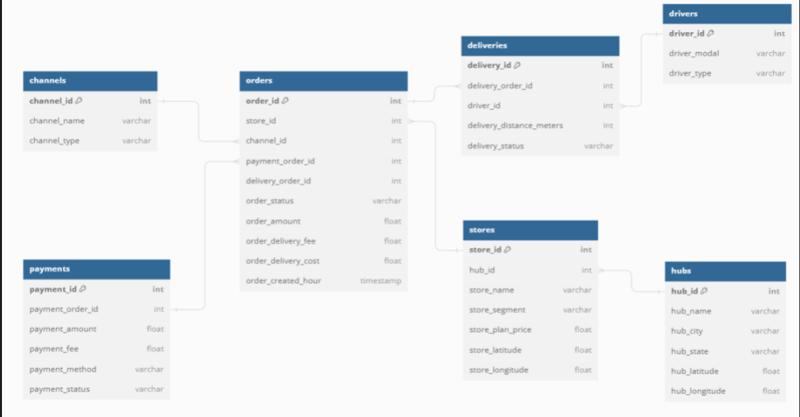

# 🛵 Delivery Analytics: Inteligência Operacional e Financeira

Este projeto apresenta uma série de análises estratégicas desenvolvidas para os times de **Marketing, Pricing e Controladoria (CFO)** de uma empresa de delivery. O foco principal é a transformação de dados brutos em indicadores de performance (KPIs) e suporte à decisão financeira.

## 🏗️ Arquitetura de Dados e Relacionamento
<p align="center">
  
</p>

## 🎯 Objetivos Estratégicos

O projeto foi estruturado para atender três frentes de negócio:

### 1. Marketing & Growth
* Identificação dos **Top 20 entregadores** com maior tração (distância total).
* Mapeamento de perfis profissionais e modais de locomoção predominantes.

### 2. Estratégia de Pricing
* Análise da distribuição de distância média por estado (focada em motocicletas).
* Subsídio de dados para ajustes regionais de taxas e remuneração.

### 3. CFO & Diretoria Executiva
* **Análise de Receita:** Segmentação por categoria (Food x Goods) e localização geográfica.
* **Cálculo de Profitability:** Implementação de lógica de custo fixo e margem de 15% sobre o GMV.
* **Participação nos Lucros:** Cálculo automatizado de bônus individual para o quadro de 2.000 colaboradores.

## 📁 Estrutura do Repositório

```text
DELIVERY_PROJECT/
├── arquivos/    # Dataset original (CSV/Raw)
├── notebooks/   # EDA e prototipagem das análises
├── src/         # Scripts Python para limpeza e cálculos (ETL)
├── results/     # Tabelas finais e dashboards agregados
├── modelo_dados.png
└── README.md
